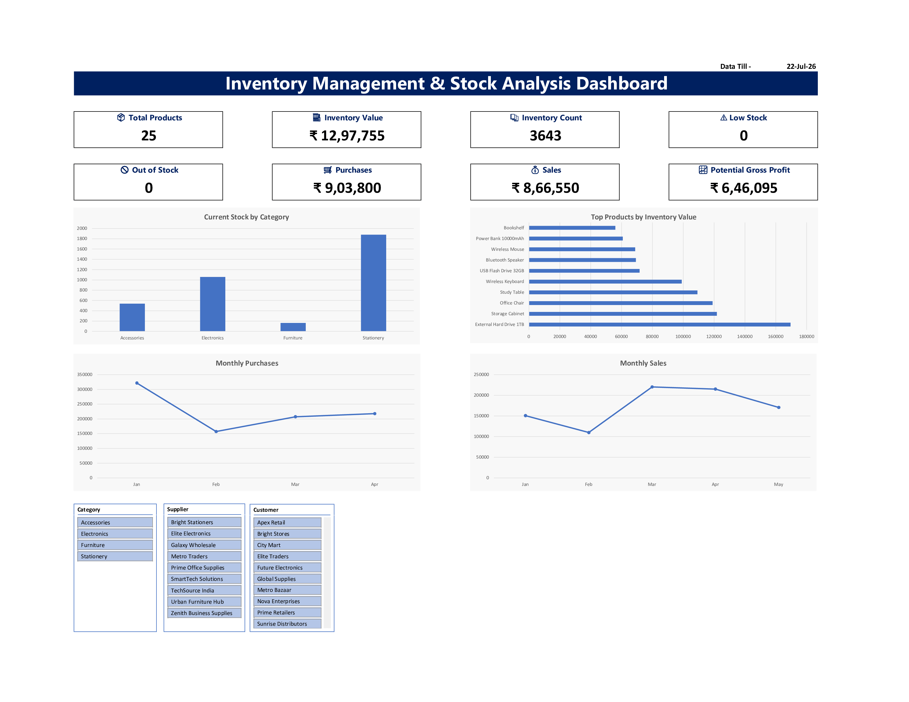

# 📦 Inventory Management & Stock Analysis Dashboard

## 📌 Overview

This project is a fully automated Inventory Management System built in Microsoft Excel.

It helps businesses manage inventory, purchases, sales and stock valuation through an interactive dashboard with real-time KPIs.

---

## ✨ Features

- Dynamic Inventory Dashboard
- Purchase Order Management
- Sales Order Tracking
- Supplier & Customer Management
- Automated Inventory Valuation
- Current Stock Calculation
- Potential Gross Profit Analysis
- Low Stock & Out of Stock Alerts
- Interactive Pivot Charts
- Slicers for Dynamic Filtering
- Data Validation for Error-Free Entry

---

## 🛠 Tools & Excel Functions Used

- Microsoft Excel
- Excel Tables
- XLOOKUP
- SUMIFS
- IF
- Data Validation
- Pivot Tables
- Pivot Charts
- Slicers
- Conditional Formatting

---

## 📊 Dashboard Preview

---

## 📁 Workbook Structure

- Dashboard
- Products
- Suppliers
- Customers
- Purchase Orders
- Sales
- Inventory Report
- Calculations

---

## 📈 Dashboard KPIs

- Total Products
- Inventory Value
- Inventory Count
- Purchase Value
- Sales Value
- Potential Gross Profit
- Low Stock Items
- Out of Stock Items

---

## 🎯 Project Highlights

✔ Real-time Inventory Tracking

✔ Automated Stock Calculations

✔ Interactive Dashboard

✔ Dynamic Reports

✔ Professional Excel Design

---

## 🚀 Author

**Vipin**

Aspiring ACCA Professional | Excel Dashboard Developer | Business Analytics Enthusiast
